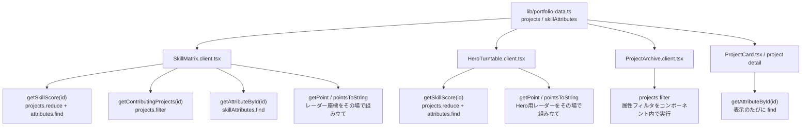
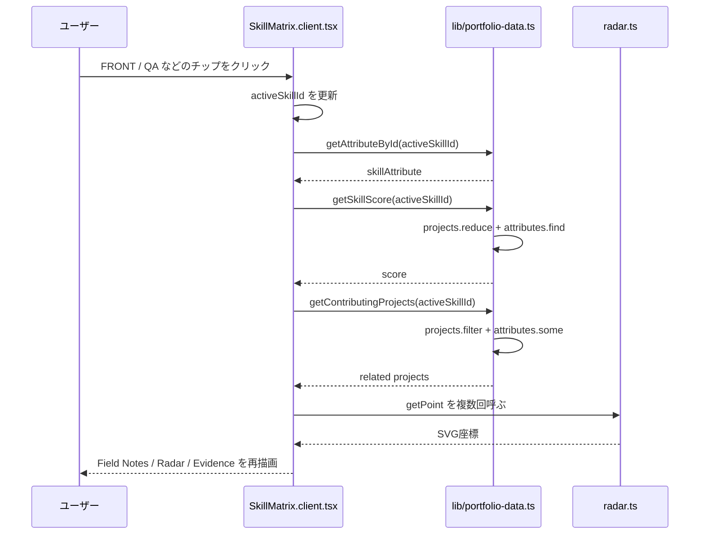
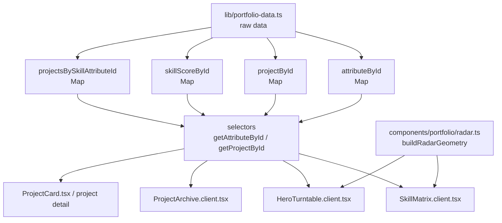
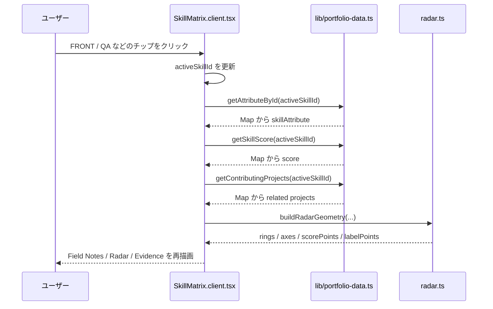
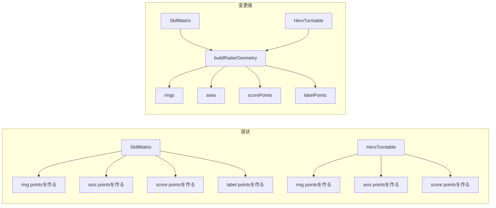
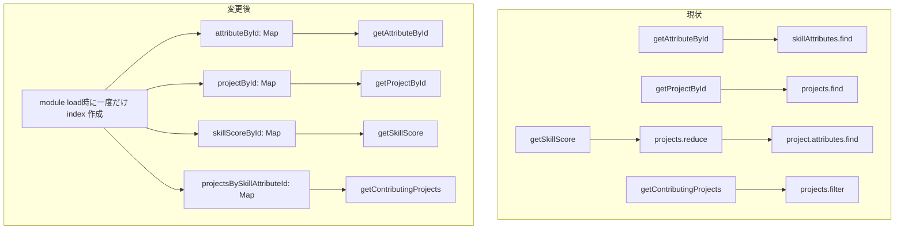
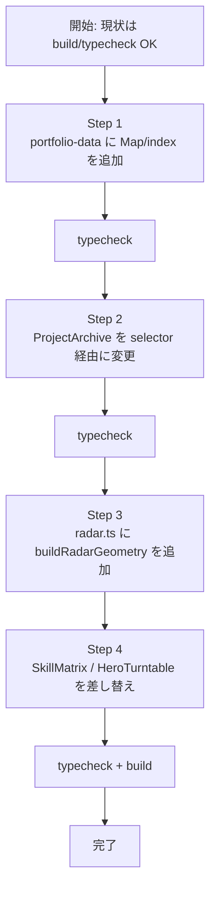

了解。実装前に、現状と変更後の差分を図で整理します。

**現状**
今はデータ取得・集計・レーダー座標生成が、表示コンポーネント側にやや散っています。

つまり、データは `lib/portfolio-data.ts` にあるけど、派生データの作り方が UI 側にも残っています。

**現状の SkillMatrix の流れ**

問題は、毎回壊れるほど重いわけではないです。ただ、責務としては `SkillMatrix` が「表示」だけでなく「データ検索」「スコア集計」「レーダー形状の組み立て」も持っています。

**変更後の狙い**
変更後は、`lib/portfolio-data.ts` が「検索済み・集計済みの入口」を持ち、`radar.ts` が「レーダー形状をまとめて作る入口」を持つ形にします。

UI 側は「どのデータを表示するか」を呼び出すだけに寄せます。

**変更後の SkillMatrix の流れ**

**レーダー整理の差分**
現状は `SkillMatrix` と `HeroTurntable` が似た計算を別々に持っています。

ここでやりたいのは、描画の見た目を変えることではなく、「多角形レーダーの形状を作る処理」を1箇所に寄せることです。

**データ検索整理の差分**

現状でもデータ量が少ないので速度問題は小さいです。ただし今後プロジェクトや属性が増えるなら、検索・集計の責務を `lib/portfolio-data.ts` に閉じ込めておく方が安全です。

**作業単位**

**重要な判断**
この変更では UI デザインや情報設計は触りません。`Project` 型や表示文言も原則そのままです。

触る予定:

- [lib/portfolio-data.ts](/Users/nagahamayuu/Documents/Projects/yuukun-portfolio/lib/portfolio-data.ts)
- [components/portfolio/radar.ts](/Users/nagahamayuu/Documents/Projects/yuukun-portfolio/components/portfolio/radar.ts)
- [components/portfolio/SkillMatrix.client.tsx](/Users/nagahamayuu/Documents/Projects/yuukun-portfolio/components/portfolio/SkillMatrix.client.tsx)
- [components/portfolio/HeroTurntable.client.tsx](/Users/nagahamayuu/Documents/Projects/yuukun-portfolio/components/portfolio/HeroTurntable.client.tsx)
- [components/portfolio/ProjectArchive.client.tsx](/Users/nagahamayuu/Documents/Projects/yuukun-portfolio/components/portfolio/ProjectArchive.client.tsx)

触らない予定:

- 見た目の Tailwind class
- `/projects/[id]` のページ構成
- 実績データの中身
- スキル属性の定義

要するに次の作業は、「表示はそのまま、データ取得とレーダー形状生成の責務を UI から外す」リファクタです。
